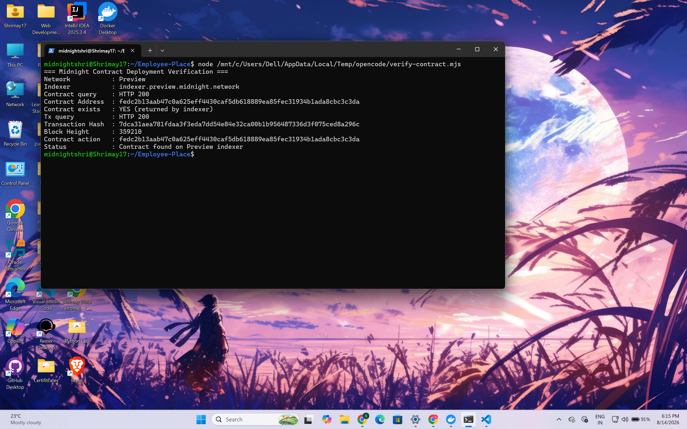

# Employee-Place

**Confidential Salary Benchmarking Pool** — a zero-knowledge salary benchmarking dApp built on the **Midnight Network** (Preview). Employees privately contribute their salary to a role/location category, and the dApp publishes aggregate salary-band distributions and quantile benchmarks — **without ever publishing anyone's exact salary**.

> Built for the **INTO the Midnight — SPPU bootcamp** track.

---

## Overview

Employee-Place lets employees answer a question most people cannot answer today without revealing sensitive personal data: *"How does my pay compare with others in the same role and location?"*

Contributors add their annual salary to a public **category** (e.g. `Software Engineer / Bengaluru`). The salary is proven in zero-knowledge against the Midnight contract, collapsed into a **coarse salary band** (e.g. `₹12L – ₹18L`), and only that band count is written to the on-chain ledger. Once a category has at least 5 contributors, coarse quantile benchmarks (25th percentile, median, 75th percentile) are published — again as bands, never as exact amounts.

The app runs entirely in the browser: a React + Vite frontend connects to the **Midnight wallet extension**, builds and signs real Midnight transactions, and reads live contract state from the **Midnight Preview indexer**.

## Problem

Salary information is one of the most sensitive pieces of personal data an employee holds, yet existing salary benchmarks force a trade-off:

- **Salary-sharing platforms require you to expose your exact salary** (or a very precise figure) to the operator and other users.
- **Self-reported surveys leak information** to whoever runs the survey and, often, to other participants.
- **Negotiating a raise** is hardest when neither side has credible, role-and-location-specific data.

An employee who wants a fair salary benchmark currently has to *trust someone with their exact number*. That trust is rarely warranted — data is leaked, sold, or correlated back to individuals.

## Solution

Employee-Place removes the trust requirement using Midnight's **zero-knowledge privacy model**:

1. **Your exact salary never leaves your device.** It exists only as a zero-knowledge *witness* inside the proving circuit. The circuit proves that the salary falls inside the **band** the UI discloses — nothing more.
2. **Only a coarse histogram is stored on-chain.** The ledger records *how many* salaries fell in each of 8 coarse INR bands, plus a contributor count — never a single salary.
3. **Quantile benchmarks are withheld until an anonymity threshold is reached.** A benchmark is only published once a category has **at least 5 contributors**; below that the contract refuses to publish (`updateBenchmark`).
4. **Contributions are pseudonymous and unlinkable.** Each contribution uses a **fresh random pseudonym key**. Only a one-way **nullifier commitment** of that key is stored, so the same key cannot contribute twice — while the key itself, and any link to a wallet address, never appears on-chain.

The result: everyone learns the *distribution* of salaries in a role/location, and nobody learns *your* salary.

## Midnight Integration

Employee-Place is a **real Midnight dApp** — it does not simulate or fake any part of the stack:

- **Wallet**: the frontend connects to the actual Midnight wallet browser extension through the official DApp-Connector API (`window.midnight` → `ConnectedAPI`). The wallet holds all secret keys, balances unsealed transactions (adding the DUST fee spend), signs them, and submits them to the network. The dApp never sees a private key.
- **Providers**: `frontend/src/lib/providers.ts` builds the real Midnight JS SDK provider set from the connected wallet:
  - `levelPrivateStateProvider` — encrypted private state in IndexedDB (via `browser-level`).
  - `indexerPublicDataProvider` — live on-chain public state from the network GraphQL indexer.
  - `FetchZkConfigProvider` — the compiled contract's zkir/keys served as static assets.
  - `httpClientProofProvider` — proves the *custom contract circuits* against the local proof server (`VITE_PROOF_SERVER_URL`); the wallet's own proving endpoint covers the DUST fee leg.
  - `createWalletProvider` / `createMidnightProvider` — adapt `balanceUnsealedTransaction` + `submitTransaction` into the SDK.
- **Contract**: a real Compact smart contract (`contracts/confidential_salary_benchmarking.compact`) with witnesses for the private inputs (`salary`, `years_of_experience`, `contributor_key`). The exact same compiled bundle drives the Node tooling, the headless simulator tests, and the browser.
- **Private state**: the salary, experience and pseudonym key are written into encrypted private state **only for the duration of a contribution proof**, then used by the circuit; the values are never rendered, logged, or transmitted.
- **Network / indexer**: the contract is deployed on the **Midnight Preview** public testnet; the frontend reads contract state via the Preview indexer's GraphQL API (polled every 8 seconds).

See [Architecture](#architecture) for the full transaction flow.

## Privacy Model

Midnight's privacy is *mathematical*: private data is proven in zero-knowledge and never placed on the ledger in the first place. This section states — precisely — what is observable and what is not.

### What an observer CAN learn

Any observer of the Midnight Preview network can legitimately read the **public ledger** of the deployed contract:

- The **contract's existence** and its address.
- The **list of categories** and their **public labels** (e.g. `Software Engineer / Bengaluru`), and whether each is open.
- Per category: the **number of contributors** and the **total number of contributions**.
- The **salary-band histogram** — how many contributions landed in each of the 8 coarse INR bands (e.g. "3 contributions in `₹12L – ₹18L`").
- **Nullifier commitments** (32-byte hashes) — the fact that a new, distinct pseudonym contributed to a category. A nullifier never repeats within a category, which is how duplicates are prevented without identities.
- Once the **5-contributor threshold** is reached and a benchmark is published: the **quantile band indices** (25th percentile, median, 75th percentile) — coarse ranges, never amounts.
- The **round counter** and transaction ordering.
- At the **network level** (not the contract): which public wallet address submitted each transaction, and when — transaction timing and metadata are public on any blockchain.
- Wallet DUST / tNIGHT balances, network id, and the indexer/node endpoints the wallet uses (shown in the dApp's Wallet status panel).

### What an observer CANNOT learn

- The **exact salary** of any contributor. The salary exists only as a zero-knowledge witness; it is never written to the ledger, emitted in an event, returned from a circuit, or logged.
- The **years of experience** of any contributor. It is only proved to lie in a valid range (0–50) and is not stored at all.
- **Which contribution belongs to which wallet or person.** No wallet address, name, company, or other identifier is stored in the ledger. Each contribution uses a fresh pseudonym key that cannot be linked to a wallet or to any previous contribution.
- The **secret pseudonym key** itself — only a one-way nullifier *commitment* of it is stored, so the key cannot be recovered from the ledger.
- **Exact quantile values** — benchmarks are published only as *band indices* (coarse ranges).
- Any **single individual's position** in the distribution below the anonymity threshold: benchmark quantiles are withheld entirely until at least 5 contributors exist.

> **Honest limitations (not exaggerated claims):**
>
> - Anonymity is a function of **pool size**. With very few contributors, even the aggregate histogram plus network-level timing could imply information about a specific contribution. The 5-contributor threshold mitigates this — it does not make it impossible.
> - An **observer of the network**, rather than of the contract, can still see that a wallet address sent a transaction at a particular time. Midnight shields the *contents* of transactions, not all network metadata.
> - The published quantiles are **coarse band approximations**, because exact per-contributor values never reach the ledger.
> - Nothing here is a security or anonymity certificate; treat it as a description of the implemented model.

## Architecture

```
┌──────────────────────────┐          ┌──────────────────────────────┐
│ Browser (React + Vite)   │          │ Midnight wallet extension    │
│  - dApp UI                │          │  - holds secret keys         │
│  - Midnight JS SDK        │  DApp-   │  - signs + submits txs       │
│  - local proving (circuit)│  Connector│  - builds the DUST fee spend │
└───────┬──────────┬────────┘          └──────────────┬───────────────┘
        │          │                                 │
        │ wallet/  │httpClientProofProvider           │ submit / balance
        │ submit   │(VITE_PROOF_SERVER_URL)          │
        ▼          ▼                                 ▼
┌───────────────────┐                        ┌───────────────────────┐
│ Local proof server│                        │ Midnight Preview net  │
│ (docker compose,  │                        │  - RPC node (public)  │
│  port 6305, CORS) │                        │  - Indexer (GraphQL)  │
└───────────────────┘                        └───────────────────────┘
```

Components:

- **`frontend/` — React + Vite dApp.** React 18, TypeScript, Vite. Builds the salary-pool UI, adapts the wallet into Midnight JS SDK providers, and proves the custom contract circuits against the local proof server.
- **Midnight smart contract** — `contracts/confidential_salary_benchmarking.compact` (Compact source), compiled by `compact compile` into `contracts/managed/confidential_salary_benchmarking` (generated; committed so CI/builds can run without the compiler).
- **Midnight wallet extension** — stores secret keys, signs transactions, and constructs the DUST fee spend internally; the dApp never sees private keys.
- **Local proof server** — `docker compose` service exposing the Midnight proving endpoint on `127.0.0.1:6305` with CORS enabled. Used by the browser to prove the *custom contract circuits* (`VITE_PROOF_SERVER_URL`); the wallet extension uses its own proving endpoint for the DUST fee leg.
- **Preview network + indexer** — the public Preview indexer (`indexer.preview.midnight.network`) provides the GraphQL public-data provider used to read live on-chain contract state.

### How a transaction flows (browser → contract)

1. The wallet connects over the DApp Connector and the dApp builds the Midnight JS SDK provider set (private state, indexer public data, ZK config, proof provider, wallet & midnight providers).
2. `connectToContract` calls `findDeployedContract` with the on-chain contract address.
3. A user action (e.g. `openCategory`, `submitSalaryContribution`) builds an "unbound" contract transaction containing the circuit proof (produced locally against the proof server) plus the private witnesses (salary, experience, contributor key) — which never leave the device.
4. The dApp sends the unsealed transaction to the wallet via `balanceUnsealedTransaction`; the wallet adds the DUST fee spend and returns a signed, finalized transaction.
5. The dApp submits it via `submitTransaction`; the wallet relays it to the Midnight node, the transaction is proven and finalized, and the indexer exposes the updated public ledger state, which the dApp polls every 8 seconds.

## Features

Real, implemented features only:

- **Midnight wallet connection** — connects to the Midnight browser wallet extension through the official DApp-Connector API (`window.midnight`), with human-readable errors for rejections and network mismatches.
- **Preview network support** — Preview (public testnet) is the canonical browser network; `preprod` and the local `undeployed` devnet are also selectable.
- **Private salary contribution** — exact salary and years of experience are proven in zero-knowledge and never leave the device; each contribution uses a fresh, unlinkable pseudonym key.
- **Salary-band histogram** — the public ledger stores and renders per-category band counts (`Salary Pools`).
- **Anonymity threshold** — benchmark quantiles are published only once a category reaches 5 contributors.
- **Category creation** — anyone can open one of the 6 category slots (0–5) with a public label (e.g. `Software Engineer / Bengaluru`).
- **Wallet / DUST diagnostics** — a `Wallet status` panel shows the wallet network, DUST balance and cap, tNIGHT balance, and the wallet's indexer/node endpoints.
- **Backup & restore** — password-encrypted export/import of private contract state and signing keys (`Backup & restore` panel) using the Midnight SDK's `exportPrivateStates()` / `exportSigningKeys()`.
- **Error decoding** — actionable messages for common failures, including the Midnight node rejection `Custom error: 170` / `171` (DUST fee-spend failures) and every contract assertion.
- **Node CLI tooling** — `src/` provides wallet setup, deploy, fund, e2e and an interactive CLI (`npm run cli`) for the same contract.

## Local Development

Prerequisites: **Node.js ≥ 22**, a package manager (npm), and **Docker** (for the proof server). A **Midnight wallet browser extension** is required to use the dApp in the browser.

```bash
# 1. Clone the repository
git clone https://github.com/shrimayblockchainer1706/Employee-Place.git
cd Employee-Place

# 2. Install dependencies (root tooling + frontend)
npm install
npm --prefix frontend install

# 3. Compile the contract (generates contracts/managed/... used by CLI tooling)
npm run compile

# 4. Configure the frontend environment
cp frontend/.env.example frontend/.env.local
#   then edit frontend/.env.local (see "Environment variables" below)

# 5. Start the required proof server (docker compose, port 6305)
npm run proof-server:start

# 6. (Optional) fund/set up the CLI wallet & deploy a contract on Preview
npm run setup

# 7. Start the frontend dev server
npm run frontend:dev        # equivalent to npm --prefix frontend run dev
```

The dev server prints a local URL (default `http://localhost:5173`). Open it, connect your Midnight wallet, and interact.

### Other useful scripts (see `package.json`)

| Command | Purpose |
|---|---|
| `npm test` | Run the vitest suite (61 tests across 7 files) |
| `npm run build` | Root TypeScript check (`tsc --noEmit`) |
| `npm --prefix frontend run typecheck` | Frontend TypeScript check |
| `npm run frontend:build` | Production build of the frontend (`frontend/dist`) |
| `npm run deploy` / `npm run cli` / `npm run check-balance` / `npm run fund` | CLI tooling against a network |
| `npm run e2e` | Full headless e2e (open → 5× private contributions → publish benchmark) on the local devnet |
| `npm run proof-server:start` / `npm run proof-server:stop` | Start / stop the proof server |

## Environment variables

All variables are read from `frontend/.env.local` (copy `frontend/.env.example`). Use **placeholders** — never commit real values. `VITE_NETWORK=preview` is the canonical default; leaving `VITE_CONTRACT_ADDRESS` empty uses the in-app "Connect"/deploy flow.

| Variable | Example / placeholder | Description |
|---|---|---|
| `VITE_NETWORK` | `preview` | Network the dApp requests from the wallet. `preview` (default), `preprod`, or `undeployed` (local devnet). |
| `VITE_CONTRACT_ADDRESS` | `fedc2b13aab47c0a625eff4430caf5db618889ea85fec31934b1ada8cbc3c3da` | Address of the deployed contract to auto-connect to (deployed on **Midnight Preview**). Leave empty for the in-app Connect/deploy flow. |
| `VITE_INDEXER_URL` | `https://indexer.preview.midnight.network/api/v4/graphql` | GraphQL endpoint used to read live contract state. Defaults to the wallet's configured indexer if unset. |
| `VITE_INDEXER_WS_URL` | `wss://indexer.preview.midnight.network/api/v4/graphql/ws` | Indexer WebSocket endpoint (public-data provider). |
| `VITE_PROOF_SERVER_URL` | `http://127.0.0.1:6305` | Local Midnight proof server used to prove the custom contract circuits (CORS enabled by `compose.yml`). |

> **⚠️ Never commit `.env.local` or any secret.** `.env.local` is covered by `*.env.local` in `.gitignore`; keep credentials, wallet keys, seeds, and tokens out of the repository.

## Testing

```bash
npm test
```

The suite is **61 tests across 7 files** (vitest) and covers real project behavior:

- `tests/salary_benchmarking.test.ts` (17) — full contract behavior via the compiled-contract simulator: band mapping, threshold, duplicate/nullifier rules, privacy assertions (the exact salary and key never appear in the serialized ledger).
- `tests/ledger.test.ts` (6) — the frontend's public-ledger projection (`queryLedgerState`) against real simulated ledger data.
- `tests/bands.test.ts` (6) — the frontend's salary-band model vs. the contract's fixed bands.
- `tests/password-policy.test.ts` (17) — the backup-password validator stays in lock-step with the Midnight SDK policy.
- `tests/backup-sdk.test.ts` (5) — real SDK private-state/signing-key backup & restore round-trips against a temporary `level` database.
- `tests/wallet-adapter.test.ts` (5) — the hex serialization bridging the wallet and the SDK transactions.
- `tests/errors.test.ts` (5) — error decoding for DUST fee-spend rejections and contract assertions.

Also verified in CI and locally:

| Command | Expected |
|---|---|
| `npm run build` | Pass — root TypeScript check |
| `npm --prefix frontend run typecheck` | Pass — frontend TypeScript check |
| `npm run frontend:build` | Pass — production Vite build of `frontend/dist` |

## Deployment / Live Demo

The frontend is a standard static Vite build — deploy `frontend/dist` to any static host (Vercel, Netlify, Cloudflare Pages, etc.).

**Deployed smart contract (Midnight Preview):**

- **Network:** Midnight Preview
- **Contract address:** `fedc2b13aab47c0a625eff4430caf5db618889ea85fec31934b1ada8cbc3c3da`



LIVE DEMO:
<https://employee-place-git-main-shrimayblockchainer1706s-projects.vercel.app/>

Before building for a host:

1. **Compile the contract** so design-time assets exist: `npm run compile` (produces `contracts/managed/…`, copied into the build by `vite-plugin-static-copy` at `/contract/compiled/…`).
2. **Set the `VITE_*` variables at build time** on the host (see Environment variables above). Vite bakes `VITE_*` values into the bundle.
3. **Build:** `npm --prefix frontend run build`, then deploy `frontend/dist`.

Vercel example: framework preset **Vite**, root directory `frontend`, build command `npm run build`, output directory `dist` — or simply a static deploy of `frontend/dist`.

> ⚠️ **Caveat for hosted demos:** proving the *custom contract circuits* is done by each visitor's browser against the **local proof server** (`VITE_PROOF_SERVER_URL`, `127.0.0.1:6305`). On a hosted site, a visitor must run the proof server on their own machine (or you must provide a hosted proving endpoint) for contract transactions to succeed. This is a functional requirement of the current architecture, not a hosting bug.

## CI/CD

A GitHub Actions workflow runs on every **push** to `main` and every **pull request** (`.github/workflows/ci.yml`):

1. Checks out the repository.
2. Sets up Node.js 22 with npm caching (root + frontend lockfiles).
3. Installs root and frontend dependencies (`npm ci`).
4. Installs the official Midnight Compact devtools and selects Compact toolchain 0.31.1.
5. Compiles the Compact contract (`npm run compile`).
6. Runs the root TypeScript check (`npm run build`).
7. Runs the frontend TypeScript check (`npm --prefix frontend run typecheck`).
8. Builds the production frontend (`npm run frontend:build`).
9. Runs the full test suite (`npm test`).

[](https://github.com/shrimayblockchainer1706/Employee-Place/actions/workflows/ci.yml)

## Security / Privacy Notes

- **Midnight stores private contract state and signing keys in browser storage** (IndexedDB, via `levelPrivateStateProvider`, encrypted at rest with the app's storage password). This is by design — it is what allows a wallet to keep working across page reloads.
- **Clearing browser storage destroys private state and signing keys irreversibly.** Use the **Backup & restore** panel to export password-encrypted backups (`exportPrivateStates()` / `exportSigningKeys()`). Exports are downloaded only to your device and are never uploaded anywhere.
- The **Backup & restore** panel is the only UI that touches private/signing material, and it is explicit and user-initiated.
- **Sensitive values (salary, experience, pseudonym key) are never rendered, logged, or sent to the app server.** The frontend contains no `console.log` of private data.
- The Midnight browser-storage message ("Private state and signing keys are stored in browser storage…") is a **security warning, not an application error** — it is intentionally not suppressed.
- Browser DevTools recommendations (React/Apollo) and extension-generated console noise (`contentscript.js`, `ObjectMultiplex`, `MaxListenersExceededWarning`) originate from browser extensions/developer tooling, not from this application.
- **No `.env.local` or secrets are committed.** Local wallet state (`.midnight-state.json`, `.midnight-wallet-state/`, `midnight-level-db/`) is git-ignored.

## Demo

Use the actual UI in the layout shown after connecting:

### A. Connect wallet
- In **Wallet & Contract**, pick the network (default **Preview**), optionally paste the deployed contract address, and click **Connect wallet**.
- Approve the connection in the wallet extension.
- Once connected you'll see your wallet address, contract address, and the **Wallet status** panel (network, DUST, tNIGHT, endpoints).

### B. Open a category
- In **Open a category**, choose a free category id (0–5) and give it a public label (e.g. `Software Engineer / Bengaluru`), then click **Open category**.
- Categories already open are disabled in the dropdown ("already …").
- The label is public; the salaries contributed to it are not.

### C. Contribute a salary
- In **Contribute your salary**, pick an open category, enter your **annual salary (INR)** (the form shows the band it maps to) and your **years of experience**, then click **Prove & submit contribution**.
- Approve the transaction (and its DUST fee) in the wallet extension.
- Only the coarse band count changes on-chain — your exact salary and experience never leave your device.

### D. View the benchmark
- The **Salary Pools** panel shows each category's band histogram and contributor count, plus the number still needed to reach the **5-contributor anonymity threshold**.
- Once the threshold is reached, press **Recompute benchmark** to publish the **25th percentile, median, and 75th percentile salary bands** (coarse bands, not exact salaries).
- Below the threshold, a message explains that the benchmark is withheld to keep individual salaries anonymous.

### Submitting (Level 3 artifacts)
- **Demo video:** [`EmployeePlace.mp4`](./EmployeePlace.mp4) — a 1-minute walkthrough of wallet connect → open category → private contribution → threshold → published benchmark.
- **Deployed-contract screenshot:** [`docs/images/deployed-contract.png`](docs/images/deployed-contract.png) — verification of the live Midnight Preview contract.
- **Test-results screenshot:** [`docs/screenshots/level3-tests.png`](docs/screenshots/level3-tests.png) — terminal output of `npm test` (7 files / 61 tests passing).

## Repository structure

```
.
├── .github/workflows/ci.yml          # CI: install → typecheck → build → test
├── frontend/                         # React + Vite browser dApp
│   ├── src/
│   │   ├── App.tsx                   # layout: wallet, pools, open, contribute, backup
│   │   ├── components/               # ConnectWallet, PoolsView, OpenCategory,
│   │   │                             # ContributeSalary, BackupPanel
│   │   ├── hooks/useMidnight.tsx     # connection + contract action state / context
│   │   └── lib/                      # wallet adapter, providers, network, ledger,
│   │                                 # witnesses (privacy), errors, bands, backup
│   └── .env.example                  # environment template (copy to .env.local)
├── contracts/
│   ├── confidential_salary_benchmarking.compact   # Midnight contract source
│   └── managed/                      # generated compile output (committed for CI)
├── src/                              # Node CLI/tooling (wallet, deploy, fund, e2e)
│   ├── wallet.ts / providers.ts      # WalletFacade + provider construction
│   └── network.ts / setup.ts         # network resolution, state file, setup
├── tests/                            # vitest suite + contract simulator
│   ├── salary_benchmarking.test.ts
│   ├── ledger.test.ts
│   ├── bands.test.ts
│   ├── errors.test.ts
│   ├── password-policy.test.ts
│   ├── backup-sdk.test.ts
│   ├── wallet-adapter.test.ts
│   └── simulator.ts
├── diag-open.ts / diag-state.ts / diag-tx.ts / diag-verify.ts   # Preview diagnostics
├── compose.yml                       # local proof server (port 6305)
├── package.json                      # root scripts/deps
└── frontend/package.json             # frontend scripts/deps
```

## Known limitations

- **Preview / testnet environment** — the deployed contract lives on the public Preview network; it is a test network and state can be reset by infrastructure changes.
- **Wallet extension required** — the browser flow needs the Midnight wallet extension; there is no keyless/embedded fallback.
- **Local proof server required** — the browser proves custom contract circuits against the local proving server (`127.0.0.1:6305`); hosted/deployed visitors must also run it (see Deployment).
- **Anonymity threshold is fixed at 5 contributors** — below that, quantile benchmarks are withheld (only aggregate histogram counts are visible); above it, a coarse 3-quantile summary is published. Anonymity is a function of pool size; small pools offer weaker anonymity.
- **Fixed capacity** — at most **6 categories** (ids 0–5) and at most **20 contributors per category** (the contract rejects further contributions with "Category is full").
- **Salary model** — contributions are annual INR salaries in one of the contract's fixed bands; out-of-range salaries (> ₹100 crore) and experience > 50 years are rejected.
- **One contribution per pseudonym per category** — duplicate contributions from the same key are rejected.

## License

`package.json` declares **MIT**. A `LICENSE` file should be added before publishing the repository publicly.
